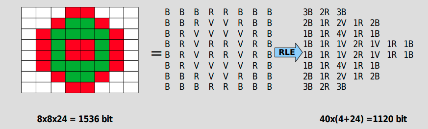

# 🖼 png-2-svg

## Generate SVG from PNG

Starting reading a `PNG` file, script compress the image using `RLE` (run-length encoding) and then convert it in  `SVG` format.

Here **high-level** steps:

1. Read a png image trough `pngjs` library
2. Encode png data using run-length encoding in the format 'hexColor' + 'width' (ex. #ffffff32) where:

- **hexColor** (#ffffff): is the color of the pixels

- **width** (32): is the number of pixels in a row

3. Decode RLE information and convert them in svg rects of `width=witdh` and `height=1`

## RLE encoding

`Run-length encoding (RLE)` is a form of lossless data compression in which runs of data (sequences in which the same data value occurs in many consecutive data elements) are stored as a single data value and count, rather than as the original run.

<p align="center">
  
</p>

## 🔗 Useful links

- [Run-length encoding](https://en.wikipedia.org/wiki/Run-length_encoding)
- [bitmap-js](https://github.com/ericandrewlewis/bitmap-js)
- [create bitmap using js](https://rephrase.net/box/bitmap/)
- [colors-converter](https://github.com/catamphetamine/color-space/blob/b940ca709c99048ee9ff3a91b7b66fdb78db72a8/source/index.js)

## 🚀 Getting Started

Here the list of available scripts:

### export png to svg

Looks for png files into the folder */src/data/images* and exports them in svg format under */src/data/export*

```shell
 npm run export
```

### encode a png file using RLE

Looks for png files into the folder */src/data/images* and exports the rle encoding under */src/data/encode*

```shell
 npm run encode
```
